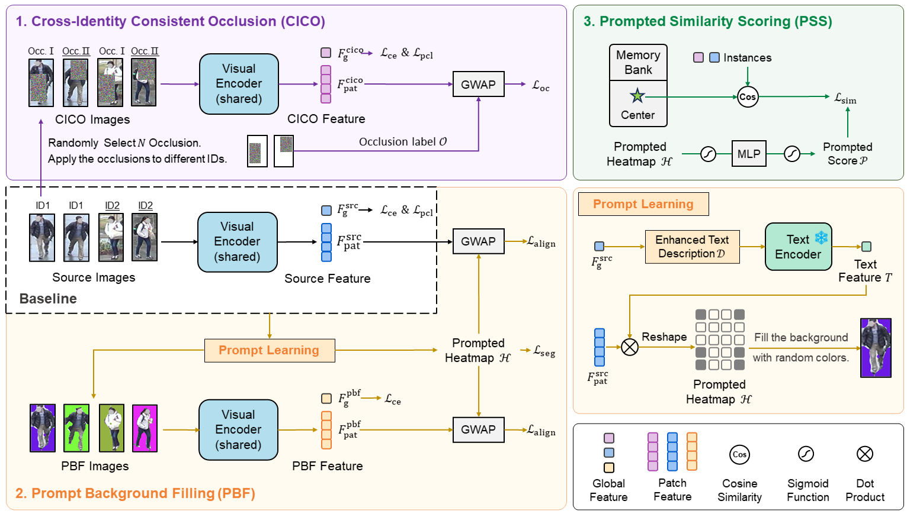
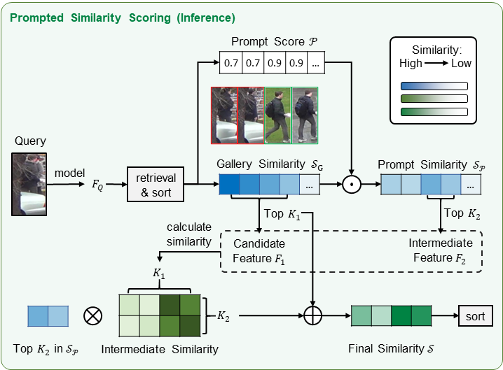

# 🔍COPE: Consistent Occlusion and Prompt Enhancement Network for Occluded Person Re-identification

## Introduction
Welcome to the official repository for **COPE** (Consistent Occlusion and Prompt Enhancement Network) — a state-of-the-art model for **Occluded Person Re-identification**!
Our method achieves 🚀 **SOTA performance** on multiple occluded and holistic person Re-ID benchmarks. 

Key Highlights:
1. We propose the COPE network, which consistently outperforms existing methods across **four occluded** and **two holistic** Re-ID datasets.  
   🏆 Notably, it achieves **82.4% Rank-1 accuracy** and **76.4% mAP** on the challenging **Occluded-Duke** dataset.
2. This repository provides **all information**: dependencies, datasets, code, trained weights, and clear instructions for testing. The complete training process will be released soon.

---

## Pipeline

### Training Stage


### Inference Stage


---

## Enviroment

Please install `conda` before proceeding.

```bash
conda create -n reid python=3.10
conda activate reid
conda install pytorch==2.5.1 torchvision==0.20.1 torchaudio==2.5.1 pytorch-cuda=12.1 -c pytorch -c nvidia
pip install -r requirements.txt
```

💡 Make sure your CUDA and PyTorch versions are compatible with your GPU setup.

---

## Datasets

Create a `data` folder under the root directory. Download and unzip the datasets into it:

### Occluded Datasets
- [Occluded-Duke](https://github.com/lightas/Occluded-DukeMTMC-Dataset)
- [Occluded-REID](https://github.com/kevinbro96/ICME2018_Occluded-Person-Reidentification_datasets)
- [P-DukeMTMC-reID](https://github.com/kevinbro96/ICME2018_Occluded-Person-Reidentification_datasets)
- [Partial-REID](https://opendatalab.org.cn/OpenDataLab/Partial-REID)

### Holistic Datasets
- [Market1501](https://drive.google.com/file/d/0B8-rUzbwVRk0c054eEozWG9COHM/view)
- [MSMT17](https://arxiv.org/abs/1711.08565)

---

## Human Parsing Labels

We use human parsing labels from **[BPBreID](https://github.com/VlSomers/bpbreid)** for five datasets:  
Market-1501, Occluded-Duke, Occluded-ReID, P-DukeMTMC, and Partial-REID.  
We use the `pifpaf_maskrcnn_filtering` labels, following their file structure.

For **MSMT17**, we generated parsing labels using the same pipeline and selected `pifpaf` as the final label source after evaluation. Related links will be provided soon. 
The expected directory structure is:

```
MSMT17
├── train
├── test
├── masks
│   └── pifpaf
├── list_gallery.txt
├── list_query.txt
├── list_train.txt
└── list_val.txt
```

📌 **Important**: Set `DATASETS.ROOT_DIR` in the config to your dataset root path — all dataset folders (`Market-1501`, `MSMT17`, etc.) should reside under this directory.

---

## Weights

We’ve open-sourced all models with a **stride size of 16** to support reproducibility and future research. 🙌  
🔗 Download links for **[trained weights](https://drive.google.com/drive/folders/1ekVtlmAv_3mkgQUIM9db6wqCrr0--rNB?usp=sharing)** are available in the model release section (check `configs/` or our model hub).

---

## Inference

Test the downloaded model with:

```bash
conda activate reid
python test_cope.py --config_file configs/<target_dataset>/cope.yml
```

Example for **Occluded-Duke**:

```bash
conda activate reid
python test_cope.py --config_file configs/OCC_Duke/cope.yml
```

🔧 Ensure that `TEST.WEIGHT` in the `.yml` config points to your downloaded checkpoint.

Config files for all datasets are located in `configs/<target_dataset>/`.
⚠️ **Note**: Make sure to download and prepare the **human parsing labels** before starting training.

---

## Acknowledgement

This codebase is built upon the excellent work of the following projects. We sincerely thank the authors for their contributions to the Re-ID community! 

1. [TransReID](https://github.com/damo-cv/TransReID)
2. [CLIP-ReID](https://github.com/Syliz517/CLIP-ReID)
3. [PCL-CLIP](https://github.com/RikoLi/PCL-CLIP)
4. [BPBreID](https://github.com/VlSomers/bpbreid)

